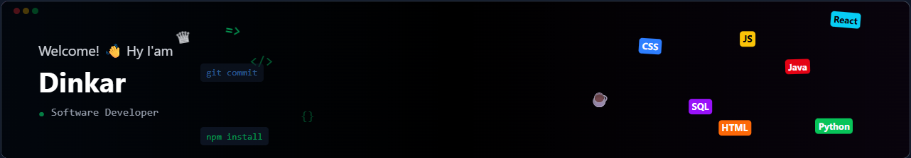

# Welcome to my GitHub Profile! 👋

Hello there! I’m Dinkar, and this is my special repository where you can get to know me and my work. Here, I showcase my projects, skills, and passion for software development 

  

  

 

## 🚀 Tech Stack

  
  
  
  
  
  
  
  
  
  
  
  
  
  
  
  

## 🌟 About Me
👨‍💻 Passionate Software Developer with expertise in Core Java, SQL, and modern web technologies including HTML, CSS, JavaScript, and ReactJS.

🔭 Actively expanding my skill set in Python, FastAPI, Data Analytics, Data Science, and Generative AI to build innovative solutions.

🌱 Committed to writing clean, efficient, and maintainable code while continuously learning and growing as a developer.

👯 Open to collaboration on projects related to data science, AI, and full-stack development to create impactful applications.

💬 Always happy to share insights or discuss topics around Java, web development, data analytics, and my professional journey.

📫 Reach me anytime at: dongredinkar34@gmail.com.

## 💼 Projects

For a list of my projects, check out my repositories!

## 🤝 Contributions

I love collaborating with others! Whether it’s contributing to open-source projects or working on side projects, feel free to reach out if you have something in mind!

Thank you for visiting my profile! 🌐

🚀 Let's connect and create something amazing together!
